## Generate binary spatial interaction networks for groups of ellipses and simulate contagion dynamics on them
 The code in ellipse_swarm.py can be used to generate spatially distributed groups of ellipses and calculate three different types of 
 spatial interaction networks based on their positions and orientations. In the (binary) interaction networks a link from individual i to individual j exists if...
 - Visual networks: ...individual j can see individual i. Visibility is defined as occupying an angular area larger than a threshold value in the visual field of individual j.
 - Metric networks: ... the euclidean distance between i and j is smaller than a threshold value.
 - Topological networks: ... if i is among the k nearest neighbors of j (k being the threshold parameter defining this network)
 
Additionally, two types of contagion dynamics, a simple and a complex fractional contagion process, can be simulated using code provided in ContagionNetworks.py 

```python
import ellipse_swarm as esw
import numpy as np
import matplotlib.pyplot as plt
import networkx as nx
import ContagionNetworks as cc
```
Inside ellipse_swarm.py there is a class called Swarm which can 
- generate spatial configurations, 
- calculate the visual field of each individual, 
- calculate the binary interaction networks (visual, metric, topological)
- do some plotting. 

### 1. Initialize a swarm


```python
mySwarm=esw.Swarm(N=9) # N is the number of individuals in the swarm
```


```python
# you can plot the ellipses via
mySwarm.plot_ellipses()
```


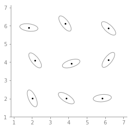


#### 1.1. Ellipse properties:

Ellipses always have a length of one and one eye.

Define the following ellipse properties when you create the swarm:
- width given by parameter w, i.e. w=1 is a circle, default is 0.3 (0<w<=1)
- position of the eye (black dot) is given by parameter l, l=-1 is the back, l=1 the front, l=0 the center (default)


```python
fig,ax=plt.subplots(1,4)
swarm=esw.Swarm(N=1,w=0.1,l=0,noise_phi=10000,noise_pos=0)
swarm.plot_ellipses(ax=ax[0])
ax[0].set_title('w = 0.1,  l = 0')

swarm=esw.Swarm(N=1,w=0.5,l=0,noise_phi=10000,noise_pos=0)
swarm.plot_ellipses(ax=ax[1])
ax[1].set_title('w = 0.5,  l = 0')

swarm=esw.Swarm(N=1,w=0.5,l=-1,noise_phi=10000,noise_pos=0)
swarm.plot_ellipses(ax=ax[2])
ax[2].set_title('w=0.5,  l = -1')

swarm=esw.Swarm(N=1,w=0.5,l=1,noise_phi=10000,noise_pos=0)
swarm.plot_ellipses(ax=ax[3])
ax[3].set_title('w = 0.5,  l = 1')

fig.set_size_inches(10,3)
plt.subplots_adjust(wspace=0.3)
```


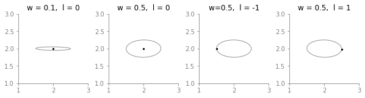


#### 1.2. Spatial configuration

You can generate positions and orientations by specifying the following when initializing a swarm:
- N (number of indidivuals)
- setup ('grid' or 'milling' or 'hexagonal')
- dist (average distance between individuals positions)
- noise_pos (noise added to individuals positions)
- noise_phi (noise added to individuals orientations)

Let's illustrate the three setups (black, without added noise, red with noise):


```python
fig,ax=plt.subplots(1,3)
#create the swarm without noise and plot it
test_swarm=esw.Swarm(N=48,setup='milling',dist=2,noise_pos=0,noise_phi=10000)
test_swarm.plot_ellipses(ax=ax[0],show_eyes=False,alpha=1)
#create the swarm with noise and plot it
test_swarm=esw.Swarm(N=48,setup='milling',dist=2,noise_pos=0.2,noise_phi=3)
test_swarm.plot_ellipses(ax=ax[0],show_eyes=False,color='r',edgecolor='none')

a=ax[0].set_title('milling')

#create the swarm without noise and plot it
test_swarm=esw.Swarm(N=48,setup='grid',dist=2,noise_pos=0,noise_phi=10000)
test_swarm.plot_ellipses(ax=ax[1],show_eyes=False,alpha=1)
#create the swarm with noise and plot it
test_swarm=esw.Swarm(N=48,setup='grid',dist=2,noise_pos=0.2,noise_phi=3)
test_swarm.plot_ellipses(ax=ax[1],show_eyes=False,color='r',edgecolor='none')

a=ax[1].set_title('grid')

#create the swarm without noise and plot it
test_swarm=esw.Swarm(N=48,setup='hexagonal',dist=2,noise_pos=0,noise_phi=10000)
test_swarm.plot_ellipses(ax=ax[2],show_eyes=False,alpha=1)
#create the swarm with noise and plot it
test_swarm=esw.Swarm(N=48,setup='hexagonal',dist=2,noise_pos=0.2,noise_phi=3)
test_swarm.plot_ellipses(ax=ax[2],show_eyes=False,color='r',edgecolor='none')

a=ax[2].set_title('hexagonal')
fig.set_size_inches(15,10)
```


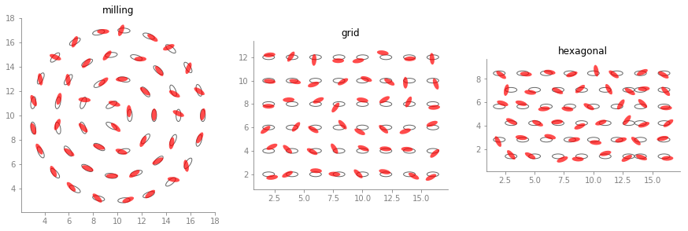


You can also read in positions and orientations of the ellipses via giving
- either of these two:
    - pos (position of the eye of the ellipses) (Nx2 or 2xN array, does not matter which)
    - pos_center (position of the center of the ellipses)
- and phi (orientations in radians)
at initialization or update them using swarm.set_pos_orient(pos,phi)

### 2. How to generate a visual, metric & topological network with a specific threshold

The Swarm class has a function for the generation of each network type (see below). Each has the option to either return only the adjacency matrix or to additionally return a networkX DiGraph, which can be used for plotting the network or to obtain network measures.


```python
mySwarm=esw.Swarm(N=9)
```


```python
visual_amat,visual_network=mySwarm.binary_visual_network(threshold=0.02,return_networkX=True)
print(np.matrix(visual_amat))
fig,ax=plt.subplots(1)
mySwarm.draw_binary_network(visual_network,fig=fig,ax=ax,ellipse_edgecolor='indigo',show_index=True)
```

  
    [[0 1 0 1 1 1 0 1 0]
     [1 0 1 1 1 1 1 0 1]
     [0 1 0 1 1 1 0 1 0]
     [1 1 1 0 1 0 1 1 1]
     [1 1 1 1 0 1 1 1 1]
     [1 1 1 0 1 0 1 1 1]
     [0 1 0 1 1 1 0 1 1]
     [1 0 1 1 1 1 1 0 1]
     [0 1 0 1 1 1 0 1 0]]


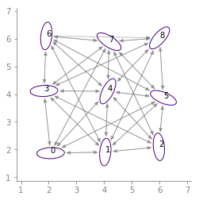


```python
metric_amat,metric_network=mySwarm.binary_metric_network(threshold=3,return_networkX=True)
print(np.matrix(metric_amat))
fig,ax=plt.subplots(1)
mySwarm.draw_binary_network(metric_network,fig=fig,ax=ax,ellipse_edgecolor='coral',show_index=True)
```

    [[0 1 0 1 0 0 0 0 0]
     [1 0 1 0 1 1 0 0 0]
     [0 1 0 0 1 1 0 0 0]
     [1 0 0 0 1 0 1 1 0]
     [0 1 1 1 0 1 1 1 1]
     [0 1 1 0 1 0 0 1 1]
     [0 0 0 1 1 0 0 1 0]
     [0 0 0 1 1 1 1 0 1]
     [0 0 0 0 1 1 0 1 0]]


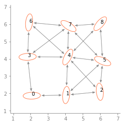


```python
topological_amat,topological_network=mySwarm.binary_topological_network(threshold=2,return_networkX=True)
print(np.matrix(topological_amat))
fig,ax=plt.subplots(1)
mySwarm.draw_binary_network(topological_network,fig=fig,ax=ax,ellipse_edgecolor='seagreen',show_index=True)
```

    [[0 1 0 1 0 0 0 0 0]
     [1 0 1 0 0 0 0 0 0]
     [0 1 0 0 0 1 0 0 0]
     [1 0 0 0 0 0 1 0 0]
     [0 0 0 0 0 1 0 1 0]
     [0 0 1 0 1 0 0 0 1]
     [0 0 0 1 0 0 0 0 0]
     [0 0 0 0 1 0 1 0 1]
     [0 0 0 0 0 0 0 1 0]]


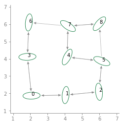


### 3. Requirements for the high density regime (overlap elimination)

If the initially generated positions contain overlaps, these are eliminated via _eliminate_overlaps() (this happens automatically if they are detected at initialization with eliminate_overlaps=True, which is default)
The overlap elimination uses code adapte from Palachanis et. Al (https://link.springer.com/article/10.1007/s40571-015-0064-5). See the readme within that publication for instructions on how to install the necessary packages.


```python
x=np.arange(2,18,1,dtype=float)
y=np.array([2.,2.5,3,4,5])
pos=np.array([[a,b] for a in x for b in y])
phi=np.random.random(len(x)*len(y))*2.*np.pi
# initialize swarm with above (overlapping) positions (pos) and orientations (phi)
mySwarm=esw.Swarm(pos=pos,phi=phi,w=0.5,eliminate_overlaps=False)
# plot the swarm with intersecting ellipses (black line)
mySwarm.plot_ellipses(show_eyes=False)
# remove the intersections and replot (in red)
mySwarm=esw.Swarm(pos=pos,phi=phi,w=0.5,eliminate_overlaps=True)
mySwarm.plot_ellipses(alpha=0.5,color='r')
plt.gcf().set_size_inches(10,10)
```


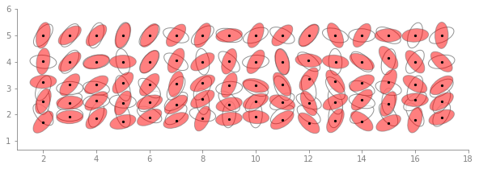


### 4. Example of how to use the code to generate Figures 1 to 3 from the Paper

Here, we generate a low resolution version of the plot in Figure 1C) (average in-degree vs. density) for a smaller group size (N=36) and only one threshold value for each network type


```python
visual_threshold=0.05
metric_threshold=3
topological_threshold=3
distances=np.arange(0.5,5.6,1)
                    
density=[]
avg_indegree_visual=[]
avg_indegree_metric=[]
avg_indegree_topological=[]

#Let's also plot the spatial configurations we create
fig,ax=plt.subplots(1,len(distances))

for i,dist in enumerate(distances):
    swarm=esw.Swarm(N=36,noise_pos=0.5,noise_phi=0.1,w=0.3,dist=dist)
    visual_amat=swarm.binary_visual_network(threshold=visual_threshold)
    metric_amat=swarm.binary_metric_network(threshold=metric_threshold)
    topological_amat=swarm.binary_topological_network(threshold=topological_threshold)
    this_density=swarm.density()
    density.append(this_density)
    avg_indegree_visual.append(np.mean(np.sum(visual_amat,axis=0)))
    avg_indegree_metric.append(np.mean(np.sum(metric_amat,axis=0)))
    avg_indegree_topological.append(np.mean(np.sum(topological_amat,axis=0)))
    # this is just plotting the swarm, not necessary to create the Figure 1C plot
    swarm.plot_ellipses(ax=ax[i],show_eyes=False)
    ax[i].set_title('density=%1.3f'%this_density)
    
fig.set_size_inches(13,4)
```

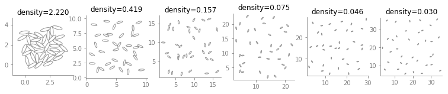


```python
fig,ax=plt.subplots(1)
ax.plot(density,avg_indegree_visual,c='indigo',marker='o')
ax.plot(density,avg_indegree_metric,c='coral',marker='o')
ax.plot(density,avg_indegree_topological,c='seagreen',marker='o')
ax.set_xscale('log')
ax.set_ylabel('avg. in-degree')
ax.set_xlabel('density [BL$^2$]')
```

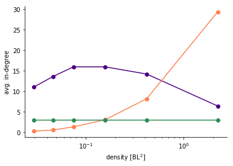


#### Other network measures

Let's use one metric network to show the calculation of other network measures:


```python
swarm=esw.Swarm(N=36,eliminate_overlaps=False)
adjacency_matrix,network=swarm.binary_metric_network(return_networkX=True)

polarization=swarm.polarization()
avg_shortest_path=nx.average_shortest_path_length(network)
avg_clustering=np.mean(np.array(list(nx.clustering(network).items()))[:,1])
avg_rel_link_length=np.sum(swarm.metric_distance_center*adjacency_matrix)/(np.sum(adjacency_matrix)*np.amax(swarm.metric_distance_center))
```


```python
print('polarization: %1.4f'%polarization)
print('avgerage shortest path; %1.4f'%avg_shortest_path)
print('average clustering coefficient: %1.4f'%avg_clustering)
print('average relative link length: %1.4f'%avg_rel_link_length)
```

    polarization: 0.1920
    avgerage shortest path; 1.7873
    average clustering coefficient: 0.7033
    average relative link length: 0.2251


### 5. Running contagion dynamics on the networks 

#### 5.1. Simple Contagion

```python
swarm=esw.Swarm(N=81)
adjacency_matrix,network=swarm.binary_metric_network(return_networkX=True,threshold=5)

simtime=100
N=swarm.n
contagion_type='simple'
recovery_rate=0.03
init_infected_nodes=[0,4,5] # ids of initially infected nodes
infection_rate = 0.3
threshold_complexContagion=None
steepness_complexContagion=None

SIR_parameters=cc.InitParameters(simtime=simtime,
                                 N=N,
                                 contagion_type=contagion_type,
                                 recovery_rate=recovery_rate,
                                 init_infected_nodes=init_infected_nodes, 
                                 infection_rate=infection_rate,
                                 threshold_complexContagion=threshold_complexContagion,
                                 steepness_complexContagion=steepness_complexContagion)

# Here we generate 10 cascades and plot the temporal evolution of the activated fraction of individuals
fig,ax=plt.subplots(1)
for i in range(10):
    outdata = cc.SingleRun(SIR_parameters, adjM=adjacency_matrix, pos=swarm.pos.T)
    time=outdata['time']
    activated_fraction=(np.array(outdata['ninf'])+np.array(outdata['nrec']))/swarm.n
    ax.plot(time,activated_fraction,color='r',alpha=0.2)
```

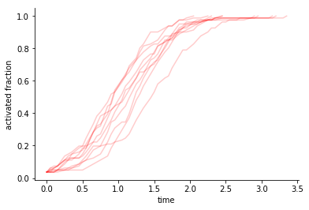


cc.SingleRun returns a dictionary with the following entries:

- outdata['state'] contains a time series of the state of each node with 1=infected, 0=susceptible, -1=recovered
- outdata['ninf'] number of infected individuals at time t
- outdata['nrec'] number of recovered individuals at time t
- outdata['time'] time t
- outdata['edgelist'] the adjacency matrix as a list of existing network links

From these the time to 75% activation (infected + recovered individuals) is calculated


#### 5.2 Complex Contagion


```python
swarm=esw.Swarm(N=81)
adjacency_matrix,network=swarm.binary_metric_network(return_networkX=True,threshold=5)

simtime=100
N=swarm.n
contagion_type='complex_fractional'
recovery_rate=0.03
init_infected_nodes=[0,4,5] # ids of initially infected nodes
infection_rate = 0.3
threshold_complexContagion=0.3
steepness_complexContagion=10
```


```python
SIR_parameters=cc.InitParameters(simtime=simtime,
                                 N=N,
                                 contagion_type=contagion_type,
                                 recovery_rate=recovery_rate,
                                 init_infected_nodes=init_infected_nodes, 
                                 infection_rate=infection_rate,
                                 threshold_complexContagion=threshold_complexContagion,
                                 steepness_complexContagion=steepness_complexContagion)

# Here we generate 10 cascades and plot the temporal evolution of the activated fraction of individuals
fig,ax=plt.subplots(1)
for i in range(10):
    outdata = cc.SingleRun(SIR_parameters, adjM=adjacency_matrix, pos=swarm.pos.T)
    time=outdata['time']
    activated_fraction=(np.array(outdata['ninf'])+np.array(outdata['nrec']))/swarm.n
    ax.plot(time,activated_fraction,color='r',alpha=0.2)
```

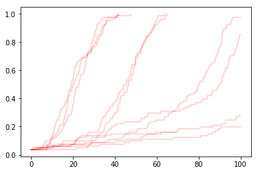


```python

```
